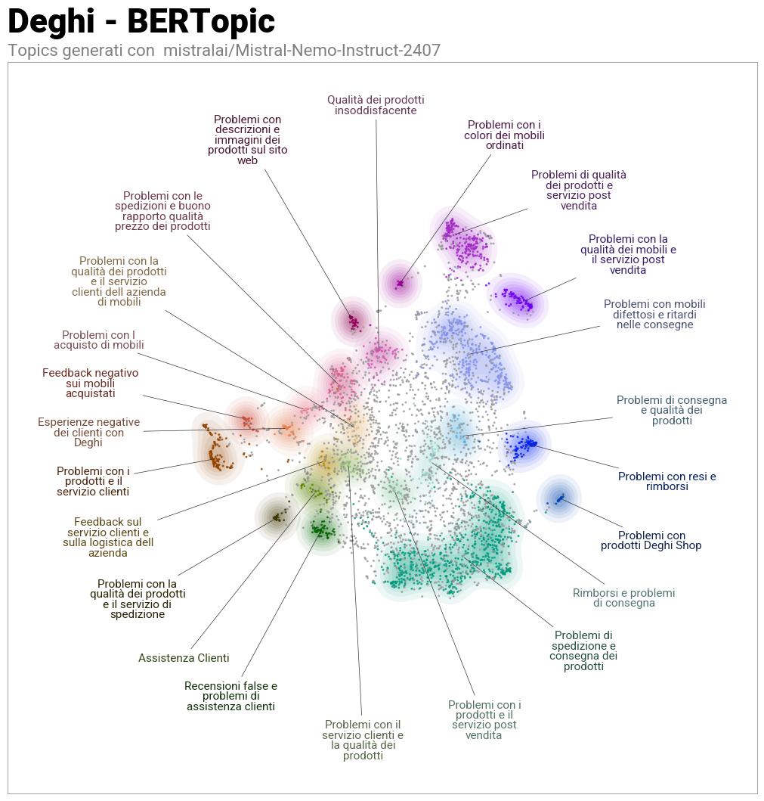

# Deghi Trustpilot Topic Modeling

“Deghi is an Italian e-commerce company specializing in home and garden furniture, bathroom fixtures, and interior design products. It operates primarily online, offering a wide catalog of affordable items for furnishing and home improvement.”
Topic modeling pipeline for analyzing Trustpilot reviews of **Deghi**, combining text preprocessing, sentence embeddings, clustering with **BERTopic**, and **LLM-based topic labeling**.

---

## 📌 Project Overview
This project applies **Natural Language Processing (NLP)** techniques to customer reviews in order to extract recurring themes, identify pain points, and provide actionable insights.

**Main steps:**
1. **Data loading** from Trustpilot reviews (`deghi_dataset.csv`).
2. **Text preprocessing**:
   - Lowercasing
   - Removing punctuation, numbers, and symbols
   - Cleaning stopwords
3. **Chunking**: splitting long reviews into smaller sentence blocks using **spaCy**.
4. **Embeddings**: generating dense vector representations with `paraphrase-multilingual-MiniLM-L12-v2`.
5. **Topic Modeling**: 
   - Dimensionality reduction with **UMAP**
   - Clustering with **HDBSCAN**
   - Topic refinement with **ClassTfidfTransformer** and `CountVectorizer`
6. **Topic Labeling**:
   - **KeyBERTInspired** for keyword-based labels
   - **Mistral LLM** (`mistralai/Mistral-Nemo-Instruct-2407`) for short descriptive labels
7. **Visualization**:
   - Topic hierarchy
   - 2D embedding map with **datamapplot**

---

## 🎓 Academic Context
This project was developed as part of the **Deep Learning course** taught by **Prof.ssa Francesca Fallucchi**  
at **Università degli Studi Guglielmo Marconi** (Rome, Italy).

---

## 📂 Repository Structure
```
.
├── deghi_dataset.csv        # Trustpilot dataset (input data)
├── result/
│   └── topic_info.csv       # Exported topics with labels
├── iframe_figures/          # Interactive BERTopic visualizations
├── cluster_deghi.png        # Cluster visualization (BERTopic results)
├── deghiTrustpilot.md       # Jupyter/Colab notebook with full workflow
└── README.md                # Project documentation
```

---

## 📊 Example Output

Here is an example of the **topic clustering visualization** generated with BERTopic:



- **Main themes identified**:
  - Delivery delays and shipping times
  - Defective or low-quality furniture (tables, chairs, shower boxes)
  - Refund and return issues
  - Mismatch between product photos and reality
  - Negative customer service experiences

- **Number of topics**: ~23 + outliers  
- **Visuals**: hierarchy dendrogram and 2D topic map

---

## ⚙️ Requirements
Main dependencies:
- Python 3.9+
- pandas, numpy, matplotlib, seaborn
- spacy (`it_core_news_sm`)
- sentence-transformers
- BERTopic
- UMAP-learn, HDBSCAN
- transformers (Hugging Face)
- datamapplot
- nltk (stopwords)

Install with:
```bash
pip install -r requirements.txt
```

---

## ▶️ Usage
1. Clone the repo:
```bash
git clone https://github.com/YOUR_USERNAME/deghi-trustpilot-topics.git
cd deghi-trustpilot-topics
```

2. Prepare the dataset (`deghi_dataset.csv`).

3. Run the notebook:
```bash
jupyter notebook deghiTrustpilot.md
```

4. Export results:
- Clustered topics (`topic_info.csv`)
- Interactive visualizations (topic hierarchy, embeddings map)

---

## 🔮 Future Improvements
- Extend to multi-company datasets
- Evaluate topic coherence metrics
- Automate dashboard integration (e.g., Plotly Dash / Streamlit)
- Fine-tune embeddings on Italian domain-specific corpora

---

## 📜 License
This project is released under the **MIT License**.  
Feel free to use, modify, and share.

---

## ✨ Credits
Developed as part of the **Deep Learning course** (Prof.ssa Francesca Fallucchi, UniMarconi).  
Uses [BERTopic](https://github.com/MaartenGr/BERTopic) and [Hugging Face Transformers](https://huggingface.co/).
